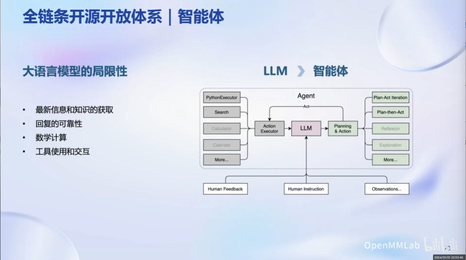

# Note: Class 1
## InternLM系列大模型

- Intern-7B是社区低成本可用最佳模型规模
- InternLM-20B更适合在商业场景进行高精度定制
- 无论是7B还是20B都是开源免费可用的，包括免费商用
## 从模型到应用

- 如果业务场景复杂，需要进行模型微调
    - 如果算力资源充足，可以进行全参数微调，如LoRA等低成本微调
    - 如果算力资源有限，进行部分参数微调
    - 如果需要与环境交互，就要构建智能体
- 模型部署：如何用更少的资源实现更好的性能/模型吞吐量？
## 开源全链条开放体系

- 应用
    - Lagent：轻量智能体搭建框架
    - AgentLego：一大供大模型调用的工具箱，能够帮助大模型轻松调用视觉、多模态等模型
### 数据：书生万卷+OpenDataLab
涵盖多种类型数据：文本、图像-文本、视频、音频、tokens语料、3D模型

### 预训练
特点：超高的预训练加速效率、极致的性能优化、与主流模型生态的兼容、开箱即用

### 微调
两种微调方式：增量续训、有监督微调（SFT）
- 增量续询：适用于学习新知识的场景
- SFT：更侧重学会理解和遵循各种指令，对垂域知识的要求比增量续训和预训练更低

- XTuner：适配多种生态、多种硬件（无论是消费级显卡还是数据中心显卡），自动优化加速（最先实现最低只需要8GB显存即可微调7B模型）

### 评测

背景：以上评测体系无法满足大语言模型全面评测需求

OpenCampass既可以进行全面评测，也可以自主选择想要评测的角度，且覆盖了目前几乎所有主流大模型

### 部署
⬇️目前研究现状

LMdeploy特点：

- 能够提供大模型在GPU上部署的全流程解决方案，包括模型轻量化、推理和服务
- 高效推理
- 无缝对接OpenCompass评测推理精度
- 和OpenAI接口高度兼容

### 智能体应用
❓大语言模型面临的问题
- 知识库的高频更新
- 逻辑推理计算
- 回复的可靠性
- 与外部工具的交互
- ......

❗️通过智能体来解决
- 网络搜索
- 代码解释器
- 策略规划
- ......

🤖轻量化智能体框架Lagent
- 支持多种类型的智能体能力，如ReAct、AutoGPT、ReWoo
- 支持多种大语言模型
- 支持丰富拓展工具
- 示例功能：代码解释器、数学求解器、多模态AI零样本泛化

🤖多模态智能体工具箱AgentLego
- 更侧重于提供丰富的工具接口，如前沿视觉、多模态算法

