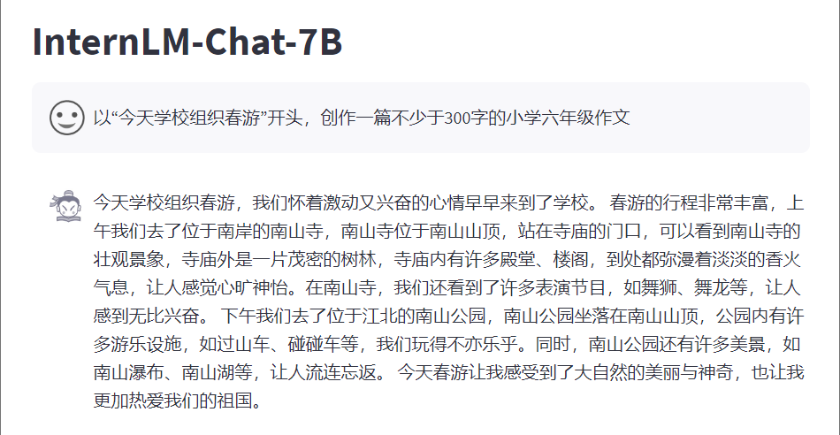
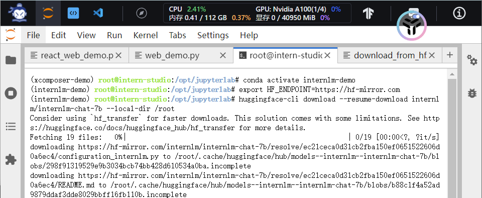
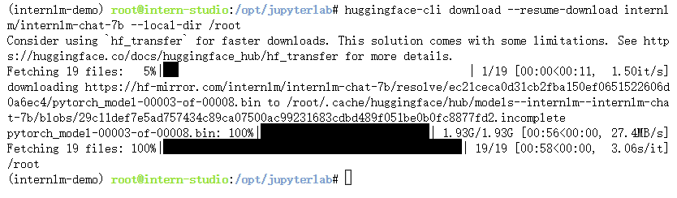
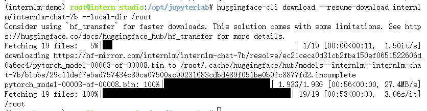

# Homework: class2
## 基础作业
### 使用 InternLM-Chat-7B 模型生成 300 字的小故事


### 熟悉 hugging face 下载功能
1. 进入正确环境后，先安装依赖
    ```bash
    pip install -U huggingface_hub
    ```
2. 然后，如下图所示，写入环境变量HF_ENDPOINT来确保下载模型时使用镜像网站内下载，否则会报503错误代码
    ```bash
    export HF_ENDPOINT=https://hf-mirror.com
    ```
    

3. 使用huggingface-cli指令下载
    ```bash
    huggingface-cli download --resume-download internlm/internlm-chat-7b --local-dir YOUR_PATH
    ```
    
4. 如下图所示，所有进度条加载完毕，说明模型下载完毕，可在下载的指定目录看到下载的所有文件

如果下载过程中出现错误代码443，关闭代理或（多次）重复步骤3可以解决问题


> 附：更多通过huggingface下载模型的方法参考：https://hf-mirror.com/

## 进阶作业
### 完成浦语·灵笔的图文理解及创作部署

### 完成 Lagent 工具调用 Demo 创作部署