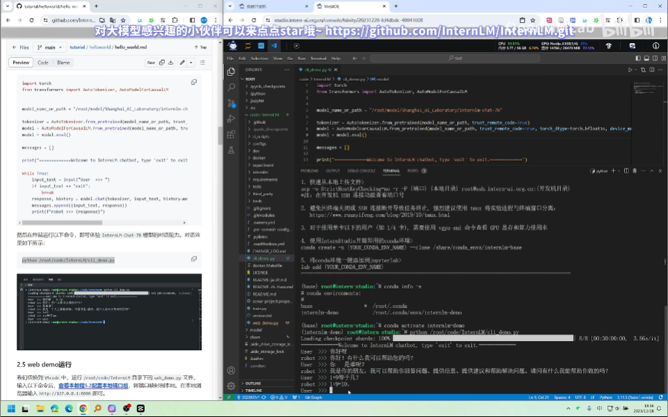
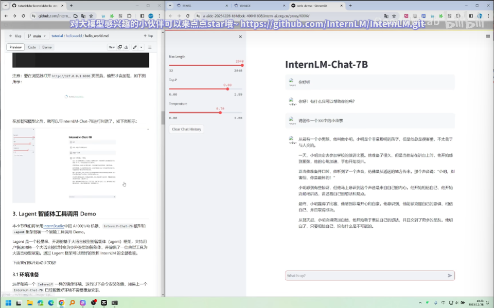
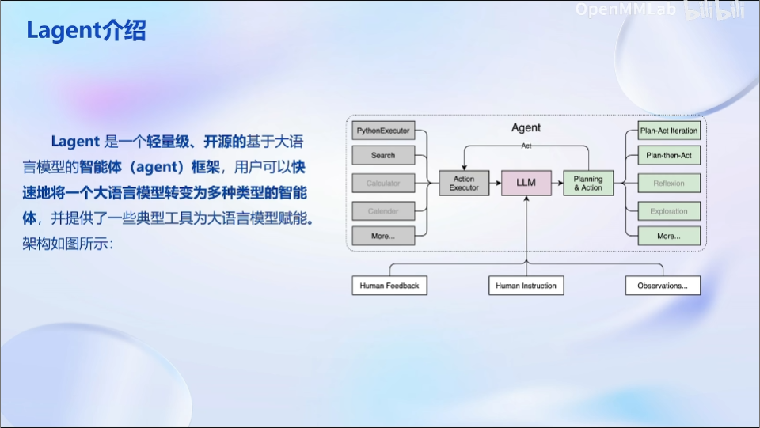
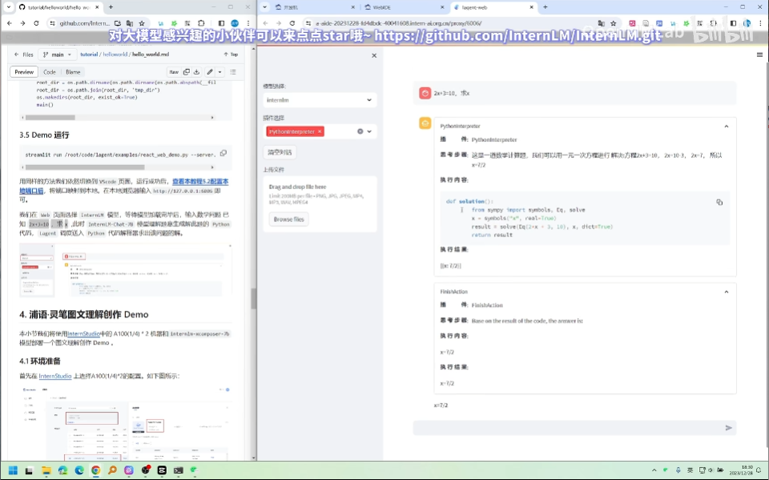
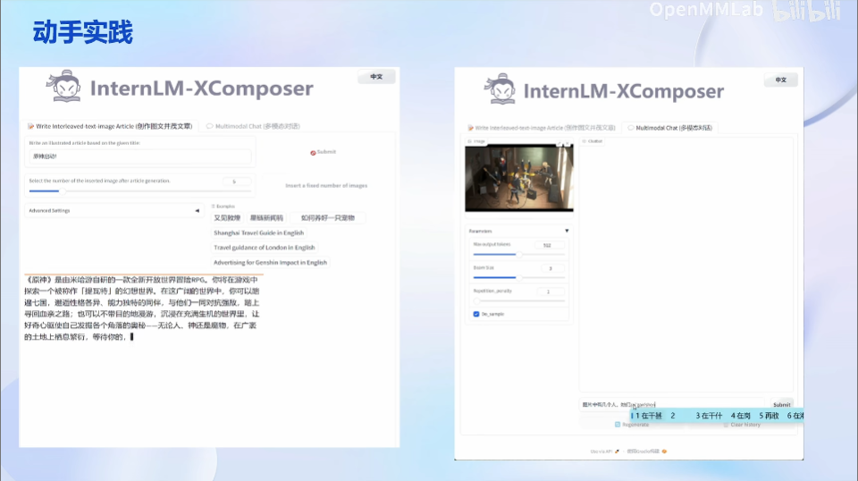
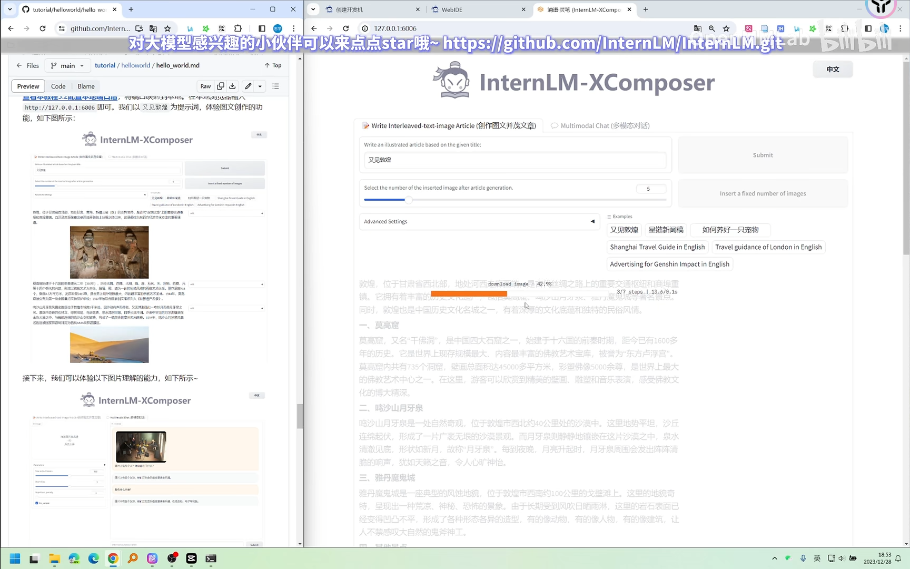
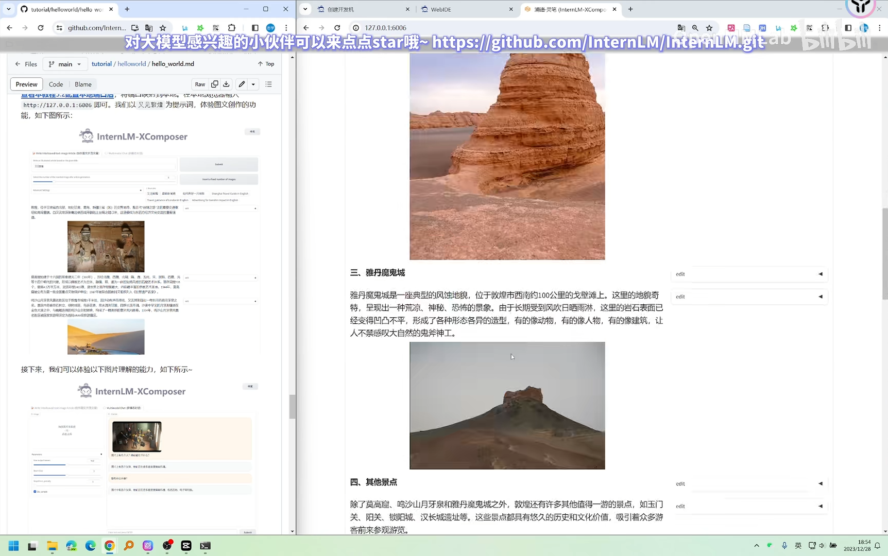
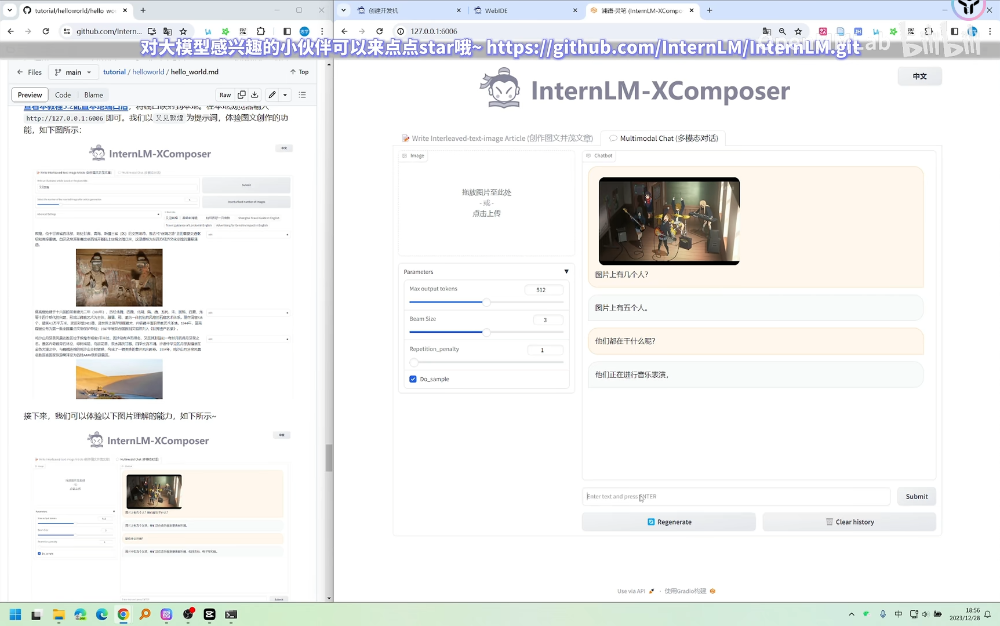

# Note: Class 1
指导文档：https://github.com/InternLM/tutorial/blob/main/helloworld/hello_world.md

## InternLM-7B Demo
### 通过命令行交互
如下图所示，通过运行cli_demo.py文件实现

### 通过网络交互
如下图，运行web_demo.py文件。*注，如果模型运行在InternStudio的开发机上，需提前配置本地与开发机的ssh连接*

## Lagent介绍
能够快速将LLM转变为多种类型的智能体

下图是一个进行数学运算的demo。如图，lagent调用了一系列组件来确保运算过程的准确性

## 灵笔图文创作
浦语·灵笔是一个LVLM，其特点有：
1. 具有强大的图文创作能力
2. 具有强大的图文理解和对话能力

*下图左侧是图文创作Demo，下图右侧是图文理解Demo*

*注，浦语·灵笔的显存开销较大，在以下Demo中采用40GB的开发机*

⬇️如下图所示，InternLM-XComposer在创作过程中先完成文字编写，再自动给予个别段落的内容搜索/生成图片；InternLM-XComposer也提供了创作完成后修改或添加图片的功能

⬇️如下图所示，InternLM-XComposer具有较强的图文理解和历史对话记忆能力

# 模型下载方式
1. 使用HuggingFace-cli下载HF上的模型
2. 通过OpenXLab平台
3. 使用modelscope库
