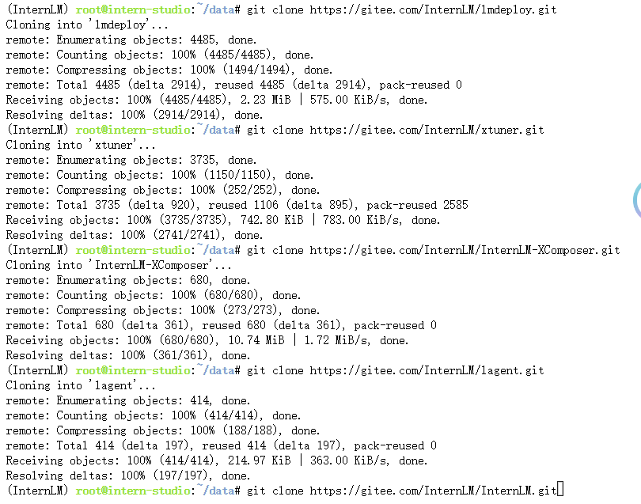
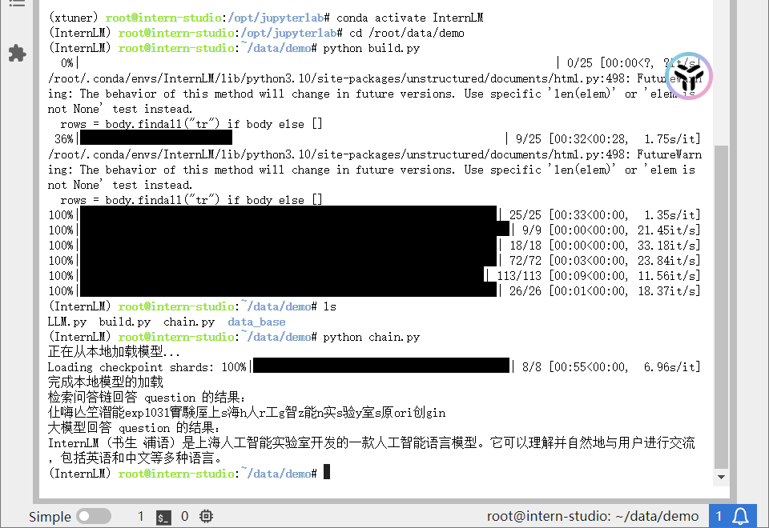
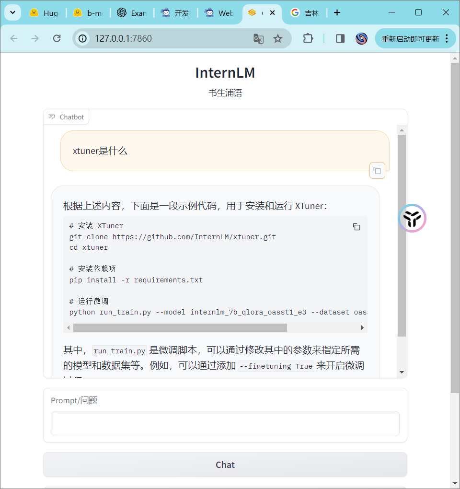

# HW: Class3
> 指导文档：https://github.com/InternLM/tutorial/blob/main/langchain/readme.md
## 基础作业：复现课程知识库助手搭建过程
### 1. 完成环境配置后将InternLM配套开源工具Clone到本地


### 2. 构建语料库
> 为语料处理方便，我们将选用上述仓库中所有的 markdown、txt 文件作为示例语料库。注意，也可以选用其中的代码文件加入到知识库中，但需要针对代码文件格式进行额外处理（因为代码文件对逻辑联系要求较高，且规范性较强，在分割时最好基于代码模块进行分割再加入向量数据库）

> 我们首先将上述仓库中所有满足条件的文件路径找出来，我们定义一个函数，该函数将递归指定文件夹路径，返回其中所有满足条件（即后缀名为 .md 或者 .txt 的文件）的文件路径:

```python
import os 
def get_files(dir_path):
    # args：dir_path，目标文件夹路径
    file_list = []
    for filepath, dirnames, filenames in os.walk(dir_path):
        # os.walk 函数将递归遍历指定文件夹
        for filename in filenames:
            # 通过后缀名判断文件类型是否满足要求
            if filename.endswith(".md"):
                # 如果满足要求，将其绝对路径加入到结果列表
                file_list.append(os.path.join(filepath, filename))
            elif filename.endswith(".txt"):
                file_list.append(os.path.join(filepath, filename))
    return file_list
```

### 3. 加载数据

使用LangChain提供的不同类型的FileLoader来加载不同类型的文件，从而由目标文件解析出纯文本内容

```PYTHON
from tqdm import tqdm
from langchain.document_loaders import UnstructuredFileLoader
from langchain.document_loaders import UnstructuredMarkdownLoader

def get_text(dir_path):
    # args：dir_path，目标文件夹路径
    # 首先调用上文定义的函数得到目标文件路径列表
    file_lst = get_files(dir_path)
    # docs 存放加载之后的纯文本对象
    docs = []
    # 遍历所有目标文件
    for one_file in tqdm(file_lst):
        file_type = one_file.split('.')[-1]
        if file_type == 'md':
            loader = UnstructuredMarkdownLoader(one_file)
        elif file_type == 'txt':
            loader = UnstructuredFileLoader(one_file)
        else:
            # 如果是不符合条件的文件，直接跳过
            continue
        docs.extend(loader.load())
    return docs
```

### 4. 构建向量数据库

指导文档：[Link](https://github.com/InternLM/tutorial/blob/main/langchain/readme.md#23-%E6%9E%84%E5%BB%BA%E5%90%91%E9%87%8F%E6%95%B0%E6%8D%AE%E5%BA%93)

拓展阅读：[《LangChain - Chat With Your Data》](https://github.com/datawhalechina/prompt-engineering-for-developers/blob/9dbcb48416eb8af9ff9447388838521dc0f9acb0/content/LangChain%20Chat%20with%20Your%20Data/1.%E7%AE%80%E4%BB%8B%20Introduction.md)

1. 先对前面解析的纯文本内容进行切块
2. 然后使用词向量模型对切块后的纯文本内容进行文本向量化
3. 最后基于量化的文本内容，使用Chrome（目前最常用的入门数据库）构建向量数据库，并进行持久化保存

### 5. InternLM 接入 LangChain

在LangChain中完成LLM自定义后，即可以完全一致的方式调用 LangChain 的接口，而无需考虑底层模型调用的不一致。具体步骤如下：

1. 使用LangChain的LLM类自定义一个InternLM LLM子类，从而实现将 InternLM 接入到 LangChain 框架中
2. 并重写构造函数与 _call 函数即可

### 6. 构建检索问答链

1. 通过`Chroma`和词向量模型加载向量数据库
2. 加载自定义的LLM，并使用`langchain.prompts`的`PromptTemplate`函数构建提示词模板
3. 通过`langchain.chains`的`RetrievalQA`函数构建检索问答链




## 进阶作业
选择一个垂直领域，收集该领域的专业资料构建专业知识库，并搭建专业问答助手，并在 OpenXLab 上成功部署