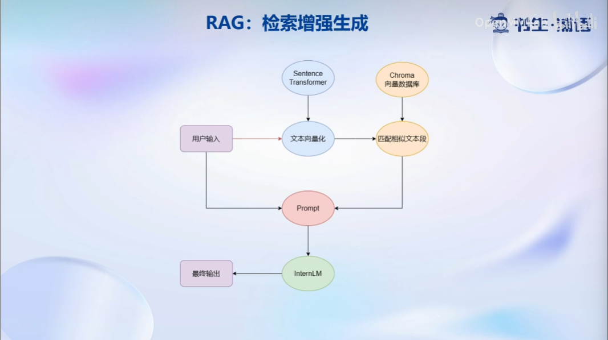
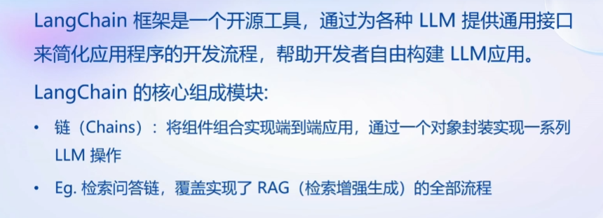
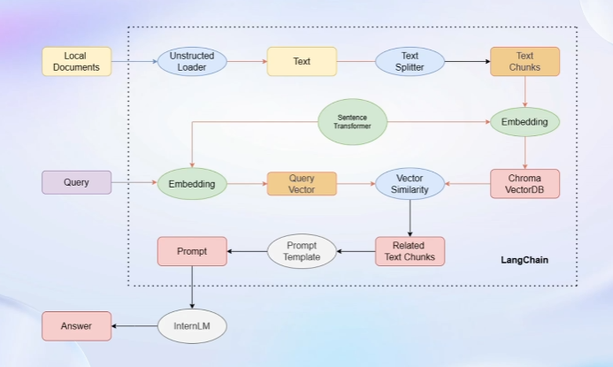
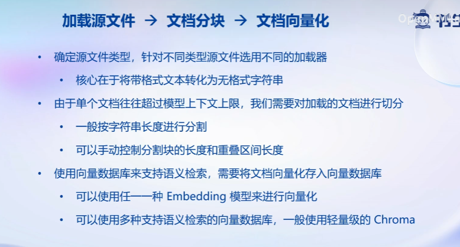
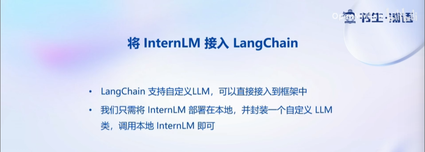
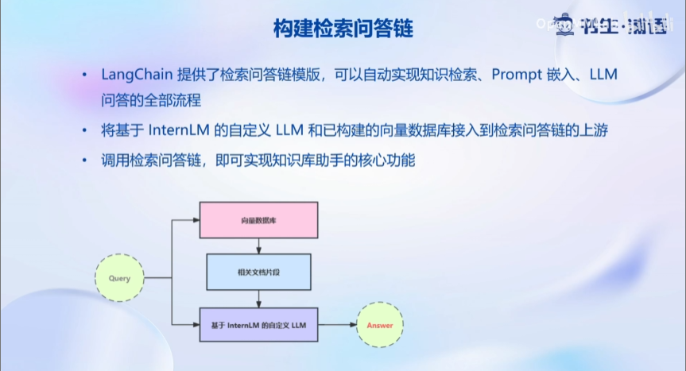
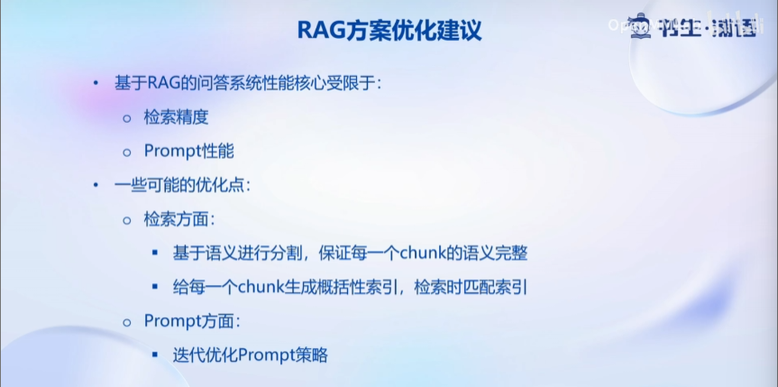

# Note3: 基于 InternLM 和 LangChain 搭建你的知识库
## 1 大模型开发范式
LLM的局限性：
1. 知识时效性受限➡️如何快速更新知识库？
2. 专业能力有限➡️如何打造垂域模型？
3. 定制化成本高➡️如何实现个性化？

在此背景下产生两种开发范式：RAG（检索增强生成） vs Finetune
- RAG：给LLM外挂一个知识库，将提问和知识库一起交给LLM来获得答案
- fine-tune：使用新数据集对大模型进行微调
- 两者各自的局限性

### RAG

RAG的原理如上图所示：
1. word转化为向量
2. 查找与向量化的提问相似的知识
3. 将用户的输入和相似的知识一起嵌入提示词并提交给LLM

## 2 如何实现RAG：LangChain

1. unstructured loader将本地文档统一转化为纯文本格式
2. sentence transformer将知识文本段向量化，并存储在向量数据库
3. 向量相似度计算和匹配
4. ......

## 3 构建向量数据库

1. 根据文件类型选择正确的加载器
2. 文档切分，防止耽搁文档超出LLM的token限制
3. 文档向量化并存储（Chroma VectorDB）

## 4 搭建知识库助手
- LangChain支持自定义LLM并介入到框架中

- LangChain可以自动实现知识检索、Prompt嵌入和LLM问答的全部流程

- RAG方案优化建议

## 5 Web Demo部署
