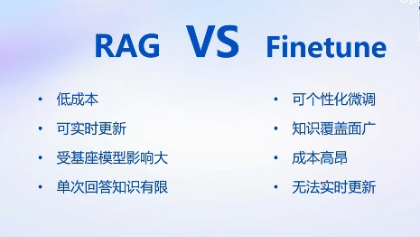

# Note3: 基于 InternLM 和 LangChain 搭建你的知识库
## 1 大模型开发范式
LLM的局限性：
1. 知识时效性受限➡️如何快速更新知识库？
2. 专业能力有限➡️如何打造垂域模型？
3. 定制化成本高➡️如何实现个性化？

在此背景下产生两种开发范式：RAG（检索增强生成） vs Finetune
- RAG：给LLM外挂一个知识库，将提问和知识库一起交给LLM来获得答案
- fine-tune：使用新数据集对大模型进行微调
- 两者各自的局限性

### RAG


RAG的原理如上图所示：
1. word转化为向量
2. 查找与向量化的提问相似的知识
3. 将用户的输入和相似的知识一起嵌入提示词并提交给LLM

## 2 如何实现RAG：LangChain


1. unstructured loader将本地文档统一转化为纯文本格式
2. sentence transformer将知识文本段向量化，并存储在向量数据库
3. 向量相似度计算和匹配
4. ......

## 3 构建向量数据库

1. 根据文件类型选择正确的加载器
2. 文档切分，防止耽搁文档超出LLM的token限制
3. 文档向量化并存储（Chroma VectorDB）

## 4 搭建知识库助手
- LangChain支持自定义LLM并介入到框架中

- LangChain可以自动实现知识检索、Prompt嵌入和LLM问答的全部流程

- RAG方案优化建议

## 5 Web Demo部署
教学视频：[Link](https://www.bilibili.com/video/BV1sT4y1p71V/?vd_source=bd86760e90841a1e69ed5d75d18ee885)
### 环境配置
1. InternLM模型部署环境配置
2. 下载InternLM-chat-7B模型
3. LangChain相关环境配置
4. 下载 NLTK 相关资源

    > 我们在使用开源词向量模型构建开源词向量的时候，需要用到第三方库 nltk 的一些资源

    > 正常情况下，其会自动从互联网上下载，但可能由于网络原因会导致下载中断，此处我们可以从国内仓库镜像地址下载相关资源，保存到服务器上。

    可以使用下图中的代码，通过`wget`指令手动下载punkt和averaged_perceptron_tagger
    
    

    也可以使用如下代码进行下载：
    ```bash
    cd /root
    git clone https://gitee.com/yzy0612/nltk_data.git  --branch gh-pages
    cd nltk_data
    mv packages/*  ./
    cd tokenizers
    unzip punkt.zip
    cd ../taggers
    unzip averaged_perceptron_tagger.zip
    ```
### 知识库搭建

指导文档：[Link](https://github.com/InternLM/tutorial/blob/main/langchain/readme.md#2-%E7%9F%A5%E8%AF%86%E5%BA%93%E6%90%AD%E5%BB%BA)

1. 数据收集
2. 加载数据
    
    根据目标文件的类型使用LangChain中不同的文件加载组件，例如使用`UnstructuredMarkdownLoader`加载.md文件

3. 构建向量数据库

    1. 需要使用LangChain的`RecursiveCharacterTextSplitter`组件对文档进行分块（chunk）
    2. 使用`HuggingFaceEmbeddings()`函数加载开源词向量模型
    3. 使用`vectordb = Chroma.from_documents(...)`函数加载向量数据库
    4. 使用`vectordb.persist()`持久保存向量数据库

4. 将InternLM 接入 LangChain

### 构建检索问答链

1. 加载向量数据库

    1. 加载词向量模型
    2. 加载向量数据库

2. 实例化自定义 LLM 与 Prompt Template
3. 构建检索问答链

    使用`RetrievalQA.from_chain_type()`函数构建问答链
    ```python
    from langchain.chains import RetrievalQA

    qa_chain = RetrievalQA.from_chain_type(
        llm,retriever=vectordb.as_retriever(),
        return_source_documents=True,
        chain_type_kwargs={"prompt":QA_CHAIN_PROMPT}
        )
    ```
    
    - 其中`as_retriever()`返回向量数据库的检索对象，`return_source_documents=True`使每次检索的片段也被返回，在`chain_type_kwargs`中定义prompt模板

    - 每次调用`qa_chai()`即可实现问答链的使用

### 构建Web Demo
参考：[Link](https://github.com/InternLM/tutorial/blob/main/langchain/readme.md#5-%E9%83%A8%E7%BD%B2-web-demo)

具体略