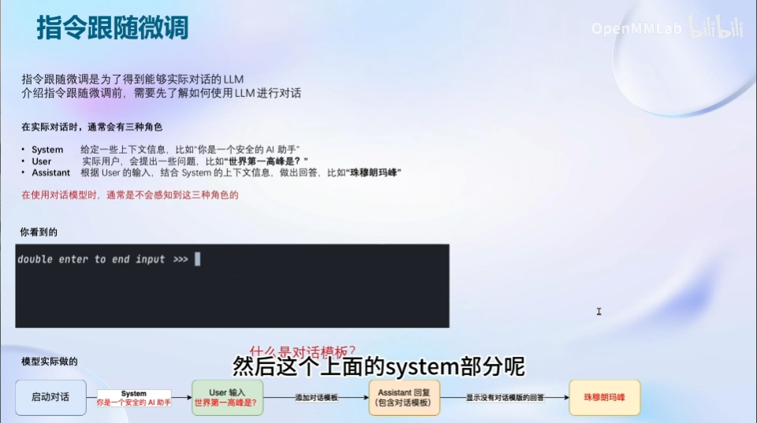
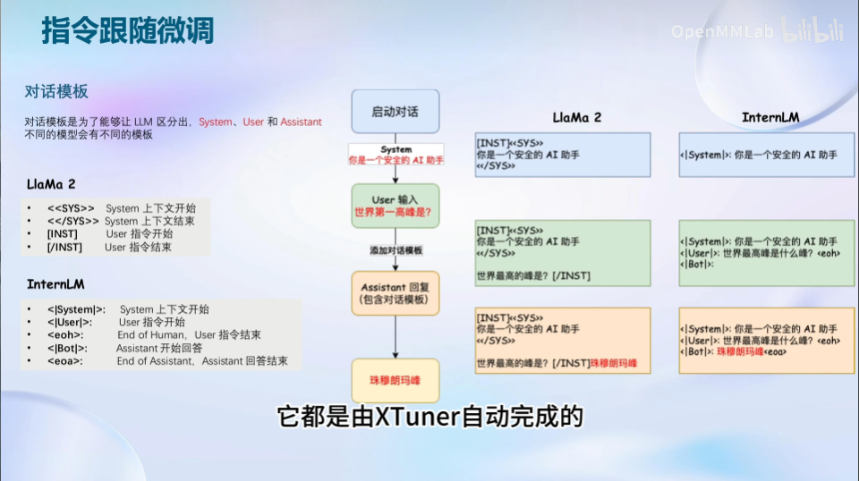
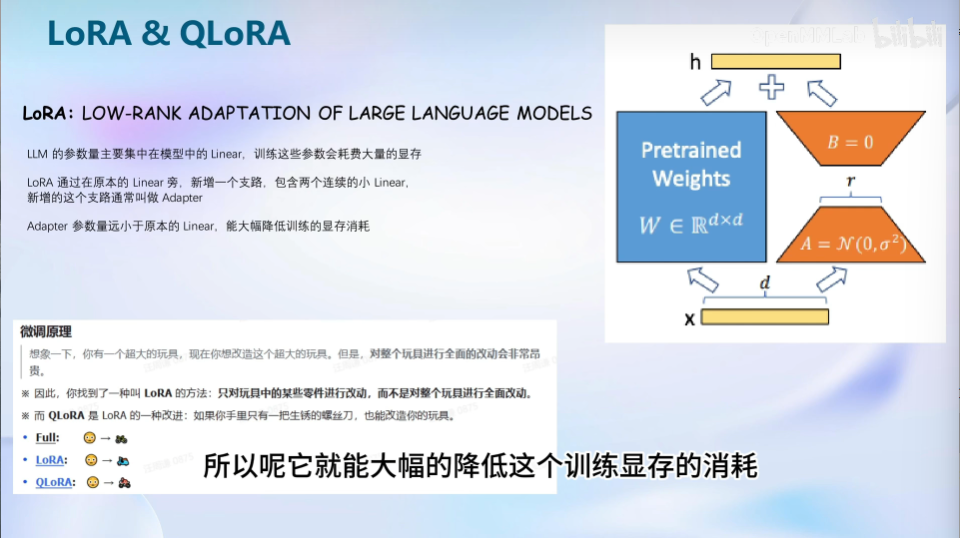
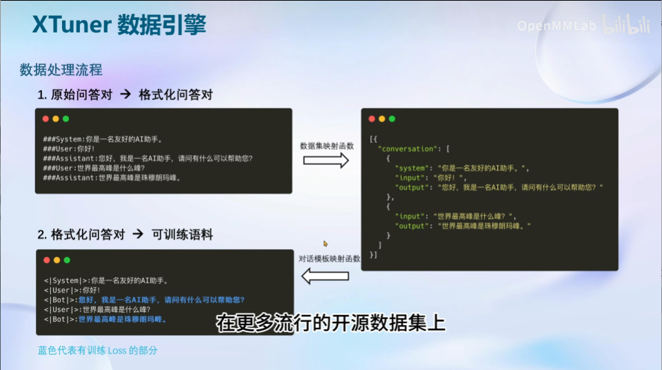
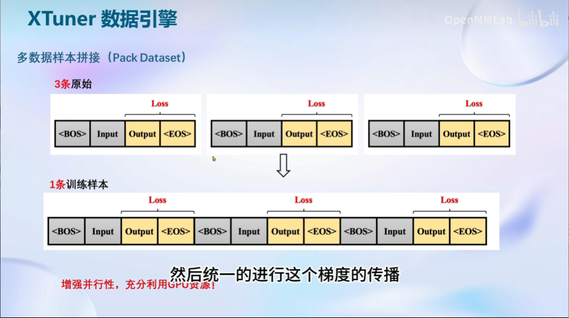
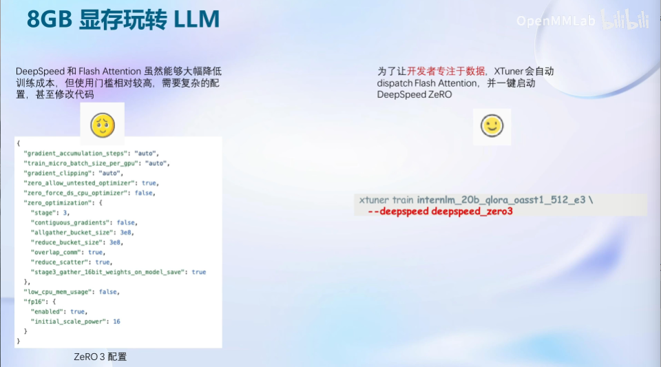
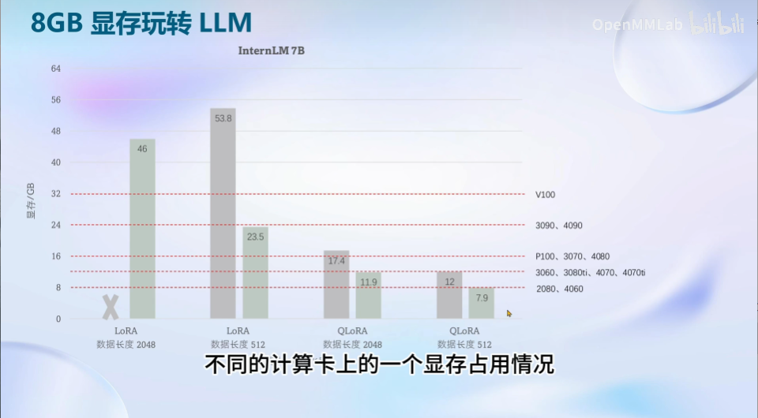
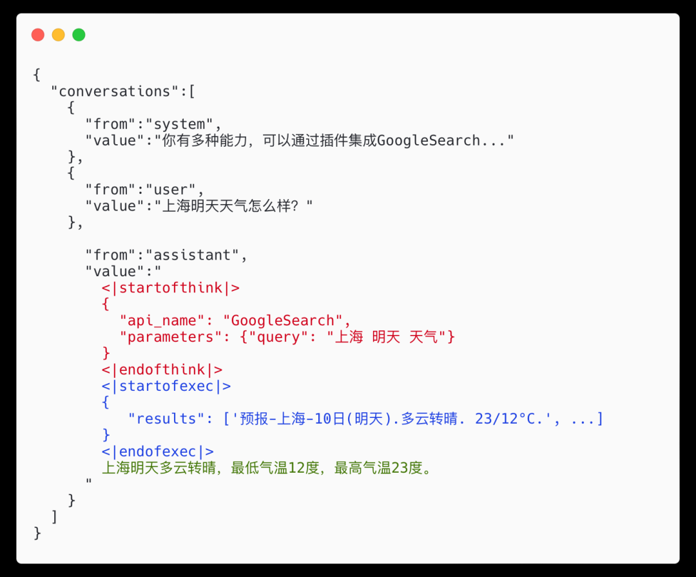

# XTuner 大模型单卡低成本微调实战
## 微调
### 指令跟随微调
在实际对话中通常存在三种角色：
- system：相当于instructor
- user：相当于question
- assistant：相当于answer

三种角色构成了对话模板，且不同LLM会有不同的LLM

在xtuner中，对话模板的角色构建是由程序自动构建的

### Xtuner中的微调原理：LoRA & QLoRA
- 为什么需要使用LoRA方法进行微调？
    - 如果对整个LLM的参数都进行微调，就需要很大的显存空间进行训练；而LoRA在模型原有Linear旁增加一个支路，在微调时只需更行这部分支路的参数，从而极大地降低微调对显存的要求
    - QLoRA是对LoRA的一种改进，进一步降低了微调门槛
    

- 全参数微调 & LoRA & QLoRA比较
    - 全参数微调需要加载所有参数
    - LoRA只需保存adapter中参数的优化器状态

    
## Xtuner

- 支持多种微调算法、模型生态
- 傻瓜化、轻量级（微调所需的最小显存仅为8GB）
- 还支持工具类模型的对话（相当于plugin）
- 一键映射对话模板

    

- 支持多数据样本拼接（如果显存充足，可以增强并行性，充分利用GPU资源）

    
## 8GB 显存玩转LLM
### Flash & DeepSpeed

- 不同微调优化方法在不同显卡上的显存开销比较⬇️

## Xtuner低成本微调实战
Tips：

- 可以使用`--deepspeed deepspeed_zero2`指令加速模型微调速度

    DeepSpeed是一个由微软开发的开源深度学习优化库，旨在提高大规模模型训练的效率和可扩展性。它通过多种技术手段来加速训练，包括模型并行化、梯度累积、动态精度缩放、本地模式混合精度等。DeepSpeed还提供了一些辅助工具，如分布式训练管理、内存优化和模型压缩等，以帮助开发者更好地管理和优化大规模深度学习训练任务。此外，deepspeed基于pytorch构建，只需要简单修改即可迁移。DeepSpeed已经在许多大规模深度学习项目中得到了应用，包括语言模型、图像分类、目标检测等等。

- 通过ssh连接远程训练时，可以借助tmux工具包，确保在ssh连接意外断开时微调训练也不会中断

    - 通过`apt update && apt install tmux`安装tmux工具包
    
    - 通过`tmux new -s [新会话名称]`创建并进入一个新的tmux会话，在tmux会话中进行的操作并不会因ssh的断开而结束
    
    - 先按`Ctrl+B`再按`D`键可以暂时退出tmux会话而不中断会话内的操作

    - 通过`tmux attach -t [会话名称]`可以回到原来的tmux会话

- 在使用`xtuner chat ...`与合并后的模型对话时，添加参数`--bits 4`可以减小模型对显存的需求，并加快推理速度

    - 另外，参数`--no-streamer`可以让LLM在回答全部生成后再一次性产出，而不是一个字一个字地生成
    - `--temperature`可以设定模型的创造性，值越高回答更富有创造力更发散，值越低回答越老实。数值介于0-1

### 【补充】用 MS-Agent 数据集 赋予 LLM 以 Agent 能力

MSAgent 数据集每条样本包含一个对话列表（conversations），其里面包含了 system、user、assistant 三种字段。其中：

- system: 表示给模型前置的人设输入，其中有**告诉模型如何调用插件以及生成请求**

- user: 表示用户的输入 prompt，分为两种，通用生成的prompt和**调用插件需求的 prompt**

- assistant: 为模型的回复。其中会**包括插件调用代码和执行代码**，调用代码是要 LLM 生成的，而执行代码是调用服务来生成结果的

一条调用网页搜索插件查询“上海明天天气”的数据样本示例如下图所示：

