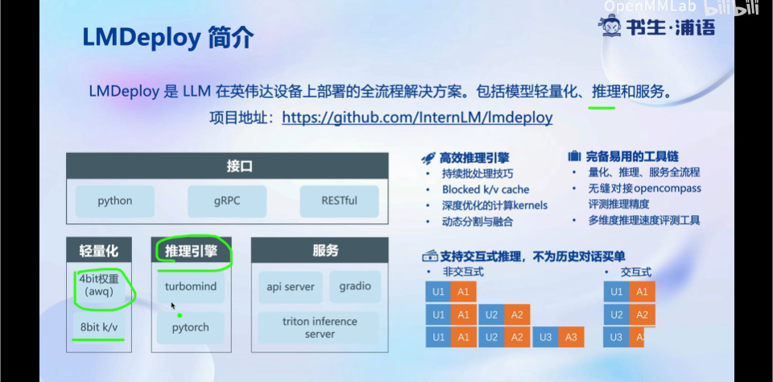

# Note: class5
## 大模型部署背景
存在的问题
- 内存开销大
- 请求数不固定，生成的token逐个生成且不固定
- LLM相对视觉模型，结构较为简单，大部分是decoder-only（token逐个生成是最大的缺点）

大模型部署挑战
- 设备（消费级显卡和手机）存储问题？
- 稳定快速推理问题，如何有效管理和利用内存？
- 如何提高系统吞吐量？对于个体用户，如何降低响应时间？

## LMDeploy
### 简介
- 是在N卡上部署的全流程解决方案

    

### 核心功能
- 量化：为什么要做weights-only的量化？

    

- 推理服务API Server

    

## 实践：安装、部署、量化
### 环境配置
### 服务部署
- 经由LMDeploy部署的服务是经典的C/S架构
    
    

#### 模型转换
使用 TurboMind 推理模型需要先将模型转化为 TurboMind 的格式，目前支持在线转换和离线转换两种形式。在线转换可以直接加载 Huggingface 模型，离线转换需需要先保存模型再加载。

- 实现多卡并行运算的原理

    

    - 列并行：将多张卡上的运算结果进行横向拼接
    - 行并行：将多张卡上的运算结果进行矩阵加法运算

#### TurboMind 推理+命令行本地对话
```bash
# Turbomind + Bash Local Chat
lmdeploy chat turbomind ./workspace
```


#### TurboMind 推理+API服务
1. 启动服务
```bash
# ApiServer+Turbomind   api_server => AsyncEngine => TurboMind
lmdeploy serve api_server ./workspace \
	--server_name 0.0.0.0 \
	--server_port 23333 \
	--instance_num 64 \
	--tp 1
```
2. 访问API
    - 在InternLMStudio开发机上时
    ```bash
    # ChatApiClient+ApiServer（注意是http协议，需要加http）
    lmdeploy serve api_client http://localhost:23333
    ```
    - 在其他机器上时，需要将开发机上的端口转发到本地
    ```bash
    ssh -CNg -L 23333:127.0.0.1:23333 root@ssh.intern-ai.org.cn -p 35128
    ```
    
    ⬆️API接口与OpenAI的接口一致
#### 网页 Demo 演示
1. TurboMind 服务作为后端

    此时turbomind和gradio通过API server通信

    参考：[link](https://github.com/InternLM/tutorial/blob/main/lmdeploy/lmdeploy.md#241-turbomind-%E6%9C%8D%E5%8A%A1%E4%BD%9C%E4%B8%BA%E5%90%8E%E7%AB%AF)

2. TurboMind 推理作为后端

    此时turbomind和gradio直接通信，启动Gradio服务后，转发端口到本地即可
    ```bash
    # Gradio+Turbomind(local)
    lmdeploy serve gradio ./workspace
    # 本地另开一个窗口
    ssh -CNg -L 6006:127.0.0.1:6006 root@ssh.intern-ai.org.cn -p 35128
    ```
#### TurboMind 推理 + Python 代码集成
参考：[link](https://github.com/InternLM/tutorial/blob/main/lmdeploy/lmdeploy.md#25-turbomind-%E6%8E%A8%E7%90%86--python-%E4%BB%A3%E7%A0%81%E9%9B%86%E6%88%90)

#### 不同部署方式适用的场景

#### 模型配置实践
可以离线转换后生成的`weights`目录中的`config.ini`文件修改模型相关的配置参数。详参：[link](https://github.com/InternLM/tutorial/blob/main/lmdeploy/lmdeploy.md#262-%E6%A8%A1%E5%9E%8B%E9%85%8D%E7%BD%AE%E5%AE%9E%E8%B7%B5)

- 在显存不足或序列较长时，设置`quant_policy = 4`，即使用KV Cache可以在输出精度大致不变的情况下减小显存开销
- 当推理文本非常长（明显超出了训练时的最大长度），将`repo_scaling_factor`和`use_logn_attn`设置为`1.0`，可以打开外推能力
- 当请求量和最大的上下文长度很大，且显存充足时，提高参数`max_batch_size`（默认为64），即提高批处理大小，可以增加模型吞吐量，但这会导致模型占用更多的显存
### 模型量化 
本部分内容主要介绍如何对模型进行量化。主要包括 KV Cache 量化和模型参数量化。总的来说，量化是一种以参数或计算中间结果精度下降换空间节省（以及同时带来的性能提升）的策略。
#### KV Cache量化
#### W4A16量化