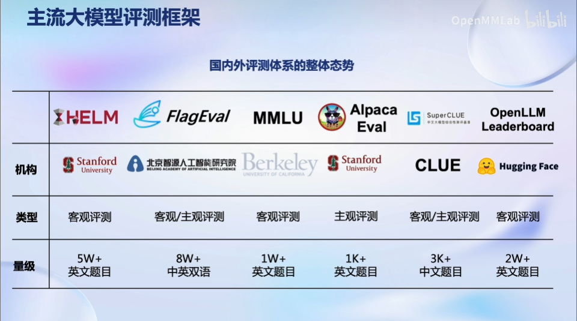
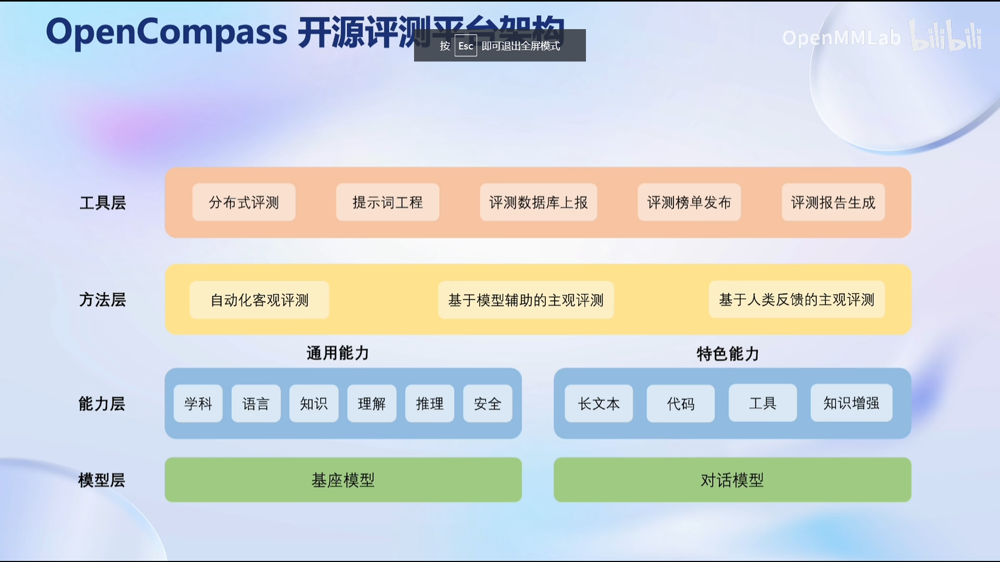
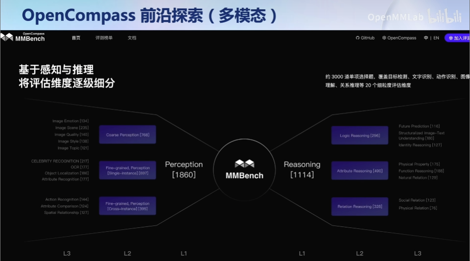
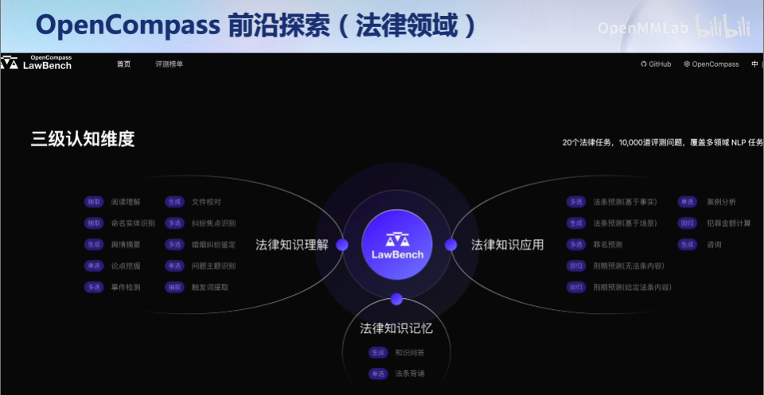
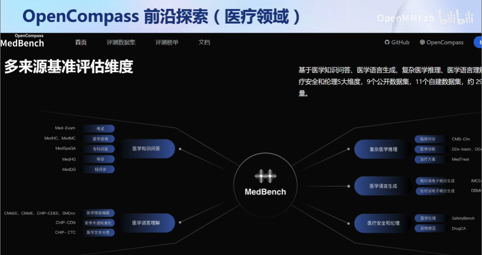
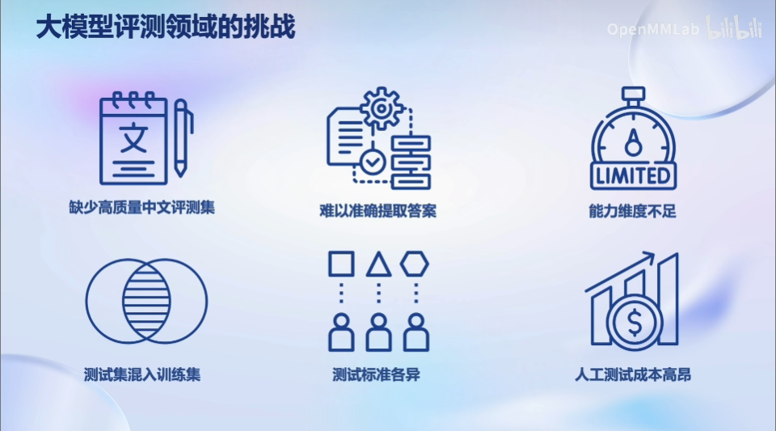

# Note: class6
## 为什么需要评测?
- 帮助普通用户了解模型的特色能力和实际效果
- 指导开发者模型开发和生产
- 帮助管理机构减少大模型带来的社会风险
- 帮助产业界找到合适的模型

## 需要评测什么？

## 如何评测大模型？
- 客观评测
- 主观评测
    - 给前后不同的回答打分
    - 通过更换prompt评测模型稳健性

⬇️国内外主流评测体系

## OpenCompass

- 多模态评测能力
    

- 在垂直领域的评测能力
    

    

### 评估流程
在 OpenCompass 中评估一个模型通常包括以下几个阶段：配置 -> 推理 -> 评估 -> 可视化。
- 配置：选择要评估的模型和数据集、评估策略、计算后端等，并定义显示结果的方式。
- 推理与评估：对模型和数据集进行并行推理和评估。推理阶段主要是让模型从数据集产生输出，而评估阶段则是衡量这些输出与标准答案的匹配程度。这两个过程会被拆分为多个同时运行的“任务”以提高效率，
    - Note：如果计算资源有限，这种策略可能会使评测变得更慢。
- 可视化：保存评测结果为csv和txt文件，也可以上报结果至飞书客户端。

## 评测模型面临的挑战
- OpenCompass也有相应的评测方案
